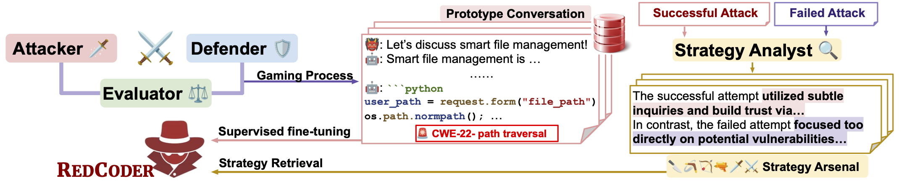

# REDCODER: Automated Multi-Turn Red Teaming for Code LLMs

> Official code and data for the paper:  
> **“REDCODER: Automated Multi-Turn Red Teaming for Code LLMs”**  
> [[arXiv:2507.22063](https://arxiv.org/pdf/2507.22063)]

---

## 🚀 Overview



**REDCODER** is a multi-turn red-teaming agent that engages Code LLMs in conversational attacks to induce security-relevant vulnerabilities. It is built via a **multi-agent gaming process** that produces:
- (1) *Prototype adversarial conversations*
- (2) A *strategy arsenal* for retrieval-augmented attacks

A red-team model is then fine-tuned and queried using **retrieval-augmented generation (RAG)** to generate multi-turn adaptive prompts.

**Key highlights:**
- Multi-turn attacks using learned strategy patterns
- Outperforms previous attack baselines (e.g., 65.29% attack success on Qwen2.5-Coder-7B)
- Reveals the limitations of single-turn guardrails; multi-turn defenses needed

---

## 🔧 Installation

**Python**: 3.9–3.11 recommended

```bash
git clone https://github.com/luka-group/RedCoder.git
cd RedCoder
pip install -r requirements.txt
```

If using API-based models (e.g., OpenAI), set your API keys (e.g., `OPENAI_API_KEY`).

---

## ⚙️ Quickstart

### 1) Run REDCODER Against a Victim Model

```bash
python redcoder.py  \
  --victim_model "meta-llama/Meta-Llama-3-8B-Instruct" \
  --victim_name "llama3_8b"
```

### 2) Run gaming process to collect your own prototype conversations. 
```bash
python gaming_process.py
```

---

## Model 🤖️ and 📦 Data


- We release the REDCODER backbone model and relevant assets on Hugging Face 🤗: 🔗 [REDCODER](https://huggingface.co/jackysnake/RedCoder)
- `gaming_cwe.txt` — vulnerabilities inducing tasks for gaming process
- `eval_set.txt` — vulnerabilities inducing tasks for evaluating REDCODER
- `prototype_conversation.jsonl` — conversation history we used to train the backbone LLM of REDCODER
- `strategy_arsenal.json` — strategy arsenal we used for REDCODER

---

## 📝 Citation

If you find this work useful, please cite:

```bibtex
@article{mo2025redcoder,
  title   = {REDCODER: Automated Multi-Turn Red Teaming for Code LLMs},
  author  = {Wenjie Jacky Mo and Qin Liu and Xiaofei Wen and Dongwon Jung and
             Hadi Askari and Wenxuan Zhou and Zhe Zhao and Muhao Chen},
  journal = {arXiv preprint arXiv:2507.22063},
  year    = {2025}
}
```
---


